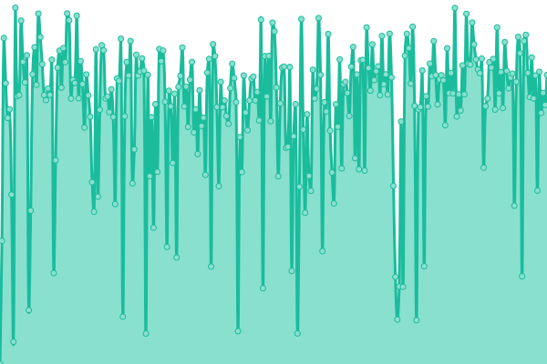
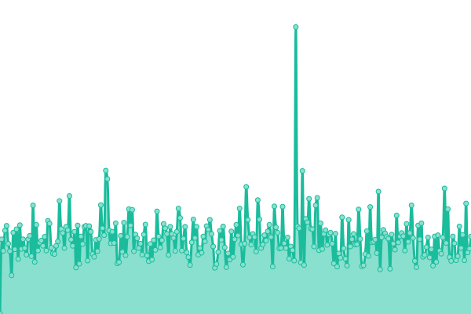
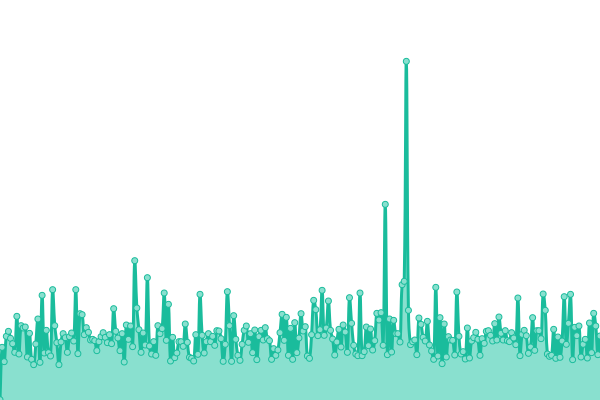
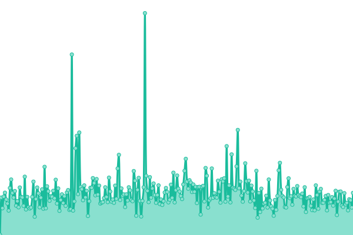
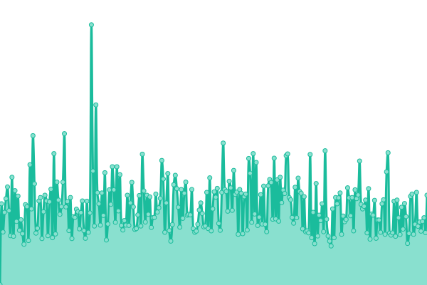
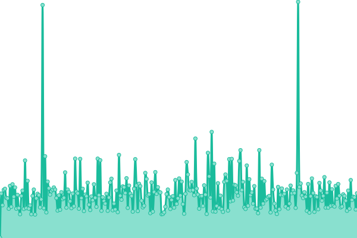
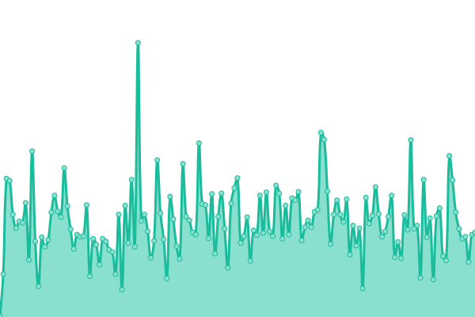
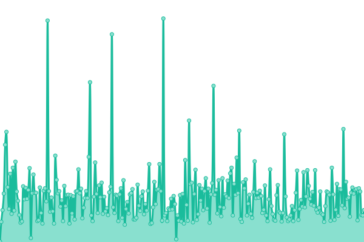

# CosmosCost Uptime & Status Monitoring

This repository contains the Upptime configuration for monitoring **CosmosCost** - a multi-tenant SaaS platform for aggregating cloud costs across AWS, GCP, and Azure.

**Status Page:** [status.cosmoscost.com](https://status.cosmoscost.com)

## Monitored Endpoints

### Core Application

- **Homepage**: https://cosmoscost.com
- **Public Health Check**: https://cosmoscost.com/api/health/public (database connectivity)
- **Dashboard**: https://cosmoscost.com/dashboard
- **Authentication**: https://cosmoscost.com/auth/signin
- **Admin Console**: https://cosmoscost.com/admin

### Marketing & Documentation

- **Documentation**: https://cosmoscost.com/docs
- **Pricing Page**: https://cosmoscost.com/pricing

### External Dependencies

- **Supabase Database**: PostgreSQL backend service health
- **Stripe API**: Payment processing service status

## Configuration Details

- **Check Interval**: Every 5 minutes via GitHub Actions
- **Response Time Tracking**: Every 30 minutes
- **Response Time Thresholds**:
  - Web pages (Homepage, Dashboard, etc.): 3,000ms
  - API endpoints: 2,000ms
  - Documentation/Pricing: 1,500ms
- **Incident Reporting**: GitHub Issues automatically created for outages
- **Status Page**: Real-time status dashboard at status.cosmoscost.com

## Public Health Endpoint

A public health check endpoint has been created at `/api/health/public` that Upptime can monitor without authentication. This endpoint performs:

- Database connectivity check (Supabase)
- Response time measurement
- System health status reporting

Response format:

```json
{
  "status": "healthy|unhealthy",
  "timestamp": "2025-11-18T10:30:00Z",
  "checks": {
    "database": {
      "status": "up|down",
      "responseTime": 145
    }
  }
}
```

HTTP Status Codes:

- `200 OK` - System is healthy
- `503 Service Unavailable` - System is unhealthy

## Setup Instructions

### Post-Deployment Tasks

1. **DNS Configuration**

   - Create a CNAME record for `status.cosmoscost.com`
   - Point to `jandro.github.io` (GitHub Pages)

2. **GitHub Pages Setup**

   - Enable GitHub Pages in repository settings
   - Source: `gh-pages` branch
   - Custom domain: `status.cosmoscost.com`

3. **GitHub Secrets** (optional for authenticated endpoints)

   - `SECRET_CUSTOMER_API_URL`: Customer API test endpoint
   - `SECRET_API_TOKEN`: Valid API authentication token

4. **First Workflow Trigger**
   - After configuration is complete, manually trigger GitHub Actions workflows to start monitoring

## Incident Response

When an endpoint goes down:

1. Upptime detects the issue within 5 minutes
2. A GitHub Issue is automatically created
3. The status page shows the incident in real-time
4. Team members can add incident updates as comments
5. Issue is automatically closed when endpoint recovers

## For More Information

- [Upptime Documentation](https://upptime.js.org)
- [CosmosCost GitHub Repository](https://github.com/jandro-dev/cosmoscost)
- Status Page Updates: Check [status.cosmoscost.com](https://status.cosmoscost.com)

---

# [](https://upptime.js.org)

This repository contains the open-source uptime monitor and status page for [jandro](https://status.cosmoscost.com), powered by [Upptime](https://github.com/upptime/upptime).

[](https://github.com/jandro/upptime/actions?query=workflow%3A%22Uptime+CI%22)
[](https://github.com/jandro/upptime/actions?query=workflow%3A%22Response+Time+CI%22)
[](https://github.com/jandro/upptime/actions?query=workflow%3A%22Graphs+CI%22)
[](https://github.com/jandro/upptime/actions?query=workflow%3A%22Static+Site+CI%22)
[](https://github.com/jandro/upptime/actions?query=workflow%3A%22Summary+CI%22)

With [Upptime](https://upptime.js.org), you can get your own unlimited and free uptime monitor and status page, powered entirely by a GitHub repository. We use [Issues](https://github.com/jandro/upptime/issues) as incident reports, [Actions](https://github.com/jandro/upptime/actions) as uptime monitors, and [Pages](https://status.cosmoscost.com) for the status page.

<!--start: status pages-->
<!-- This summary is generated by Upptime (https://github.com/upptime/upptime) -->
<!-- Do not edit this manually, your changes will be overwritten -->
<!-- prettier-ignore -->
| URL | Status | History | Response Time | Uptime |
| --- | ------ | ------- | ------------- | ------ |
|  [CosmosCost Homepage](https://cosmoscost.com) | 🟩 Up | [cosmos-cost-homepage.yml](https://github.com/cosmoscost/upptime/commits/HEAD/history/cosmos-cost-homepage.yml) | <details><summary> 2035ms</summary><br><a href="https://status.cosmoscost.com/history/cosmos-cost-homepage"></a><br><a href="https://status.cosmoscost.com/history/cosmos-cost-homepage"></a><br><a href="https://status.cosmoscost.com/history/cosmos-cost-homepage"></a><br><a href="https://status.cosmoscost.com/history/cosmos-cost-homepage"></a><br><a href="https://status.cosmoscost.com/history/cosmos-cost-homepage"></a></details> | <details><summary><a href="https://status.cosmoscost.com/history/cosmos-cost-homepage">100.00%</a></summary><a href="https://status.cosmoscost.com/history/cosmos-cost-homepage"></a><br><a href="https://status.cosmoscost.com/history/cosmos-cost-homepage"></a><br><a href="https://status.cosmoscost.com/history/cosmos-cost-homepage"></a><br><a href="https://status.cosmoscost.com/history/cosmos-cost-homepage"></a><br><a href="https://status.cosmoscost.com/history/cosmos-cost-homepage"></a></details>
|  [Public Health Check](https://cosmoscost.com/api/health/public) | 🟩 Up | [public-health-check.yml](https://github.com/cosmoscost/upptime/commits/HEAD/history/public-health-check.yml) | <details><summary> 238ms</summary><br><a href="https://status.cosmoscost.com/history/public-health-check"></a><br><a href="https://status.cosmoscost.com/history/public-health-check"></a><br><a href="https://status.cosmoscost.com/history/public-health-check"></a><br><a href="https://status.cosmoscost.com/history/public-health-check"></a><br><a href="https://status.cosmoscost.com/history/public-health-check"></a></details> | <details><summary><a href="https://status.cosmoscost.com/history/public-health-check">100.00%</a></summary><a href="https://status.cosmoscost.com/history/public-health-check"></a><br><a href="https://status.cosmoscost.com/history/public-health-check"></a><br><a href="https://status.cosmoscost.com/history/public-health-check"></a><br><a href="https://status.cosmoscost.com/history/public-health-check"></a><br><a href="https://status.cosmoscost.com/history/public-health-check"></a></details>
|  [Dashboard](https://cosmoscost.com/dashboard) | 🟩 Up | [dashboard.yml](https://github.com/cosmoscost/upptime/commits/HEAD/history/dashboard.yml) | <details><summary> 205ms</summary><br><a href="https://status.cosmoscost.com/history/dashboard"></a><br><a href="https://status.cosmoscost.com/history/dashboard"></a><br><a href="https://status.cosmoscost.com/history/dashboard"></a><br><a href="https://status.cosmoscost.com/history/dashboard"></a><br><a href="https://status.cosmoscost.com/history/dashboard"></a></details> | <details><summary><a href="https://status.cosmoscost.com/history/dashboard">100.00%</a></summary><a href="https://status.cosmoscost.com/history/dashboard"></a><br><a href="https://status.cosmoscost.com/history/dashboard"></a><br><a href="https://status.cosmoscost.com/history/dashboard"></a><br><a href="https://status.cosmoscost.com/history/dashboard"></a><br><a href="https://status.cosmoscost.com/history/dashboard"></a></details>
|  [Authentication](https://cosmoscost.com/auth/login) | 🟩 Up | [authentication.yml](https://github.com/cosmoscost/upptime/commits/HEAD/history/authentication.yml) | <details><summary> 169ms</summary><br><a href="https://status.cosmoscost.com/history/authentication"></a><br><a href="https://status.cosmoscost.com/history/authentication"></a><br><a href="https://status.cosmoscost.com/history/authentication"></a><br><a href="https://status.cosmoscost.com/history/authentication"></a><br><a href="https://status.cosmoscost.com/history/authentication"></a></details> | <details><summary><a href="https://status.cosmoscost.com/history/authentication">100.00%</a></summary><a href="https://status.cosmoscost.com/history/authentication"></a><br><a href="https://status.cosmoscost.com/history/authentication"></a><br><a href="https://status.cosmoscost.com/history/authentication"></a><br><a href="https://status.cosmoscost.com/history/authentication"></a><br><a href="https://status.cosmoscost.com/history/authentication"></a></details>
|  [Admin Console](https://cosmoscost.com/admin) | 🟩 Up | [admin-console.yml](https://github.com/cosmoscost/upptime/commits/HEAD/history/admin-console.yml) | <details><summary> 290ms</summary><br><a href="https://status.cosmoscost.com/history/admin-console"></a><br><a href="https://status.cosmoscost.com/history/admin-console"></a><br><a href="https://status.cosmoscost.com/history/admin-console"></a><br><a href="https://status.cosmoscost.com/history/admin-console"></a><br><a href="https://status.cosmoscost.com/history/admin-console"></a></details> | <details><summary><a href="https://status.cosmoscost.com/history/admin-console">100.00%</a></summary><a href="https://status.cosmoscost.com/history/admin-console"></a><br><a href="https://status.cosmoscost.com/history/admin-console"></a><br><a href="https://status.cosmoscost.com/history/admin-console"></a><br><a href="https://status.cosmoscost.com/history/admin-console"></a><br><a href="https://status.cosmoscost.com/history/admin-console"></a></details>
|  [Documentation](https://cosmoscost.com/docs) | 🟩 Up | [documentation.yml](https://github.com/cosmoscost/upptime/commits/HEAD/history/documentation.yml) | <details><summary> 184ms</summary><br><a href="https://status.cosmoscost.com/history/documentation"></a><br><a href="https://status.cosmoscost.com/history/documentation"></a><br><a href="https://status.cosmoscost.com/history/documentation"></a><br><a href="https://status.cosmoscost.com/history/documentation"></a><br><a href="https://status.cosmoscost.com/history/documentation"></a></details> | <details><summary><a href="https://status.cosmoscost.com/history/documentation">100.00%</a></summary><a href="https://status.cosmoscost.com/history/documentation"></a><br><a href="https://status.cosmoscost.com/history/documentation"></a><br><a href="https://status.cosmoscost.com/history/documentation"></a><br><a href="https://status.cosmoscost.com/history/documentation"></a><br><a href="https://status.cosmoscost.com/history/documentation"></a></details>
|  [Pricing Page](https://cosmoscost.com/pricing) | 🟩 Up | [pricing-page.yml](https://github.com/cosmoscost/upptime/commits/HEAD/history/pricing-page.yml) | <details><summary> 183ms</summary><br><a href="https://status.cosmoscost.com/history/pricing-page"></a><br><a href="https://status.cosmoscost.com/history/pricing-page"></a><br><a href="https://status.cosmoscost.com/history/pricing-page"></a><br><a href="https://status.cosmoscost.com/history/pricing-page"></a><br><a href="https://status.cosmoscost.com/history/pricing-page"></a></details> | <details><summary><a href="https://status.cosmoscost.com/history/pricing-page">100.00%</a></summary><a href="https://status.cosmoscost.com/history/pricing-page"></a><br><a href="https://status.cosmoscost.com/history/pricing-page"></a><br><a href="https://status.cosmoscost.com/history/pricing-page"></a><br><a href="https://status.cosmoscost.com/history/pricing-page"></a><br><a href="https://status.cosmoscost.com/history/pricing-page"></a></details>
|  [Supabase Service](https://suuiylxptffjqhhtpwwc.supabase.co/rest/v1/) | 🟥 Down | [supabase-service.yml](https://github.com/cosmoscost/upptime/commits/HEAD/history/supabase-service.yml) | <details><summary> 183ms</summary><br><a href="https://status.cosmoscost.com/history/supabase-service"></a><br><a href="https://status.cosmoscost.com/history/supabase-service"></a><br><a href="https://status.cosmoscost.com/history/supabase-service"></a><br><a href="https://status.cosmoscost.com/history/supabase-service"></a><br><a href="https://status.cosmoscost.com/history/supabase-service"></a></details> | <details><summary><a href="https://status.cosmoscost.com/history/supabase-service">31.76%</a></summary><a href="https://status.cosmoscost.com/history/supabase-service"></a><br><a href="https://status.cosmoscost.com/history/supabase-service"></a><br><a href="https://status.cosmoscost.com/history/supabase-service"></a><br><a href="https://status.cosmoscost.com/history/supabase-service"></a><br><a href="https://status.cosmoscost.com/history/supabase-service"></a></details>
|  [Stripe API Status](https://status.stripe.com) | 🟩 Up | [stripe-api-status.yml](https://github.com/cosmoscost/upptime/commits/HEAD/history/stripe-api-status.yml) | <details><summary> 121ms</summary><br><a href="https://status.cosmoscost.com/history/stripe-api-status"></a><br><a href="https://status.cosmoscost.com/history/stripe-api-status"></a><br><a href="https://status.cosmoscost.com/history/stripe-api-status"></a><br><a href="https://status.cosmoscost.com/history/stripe-api-status"></a><br><a href="https://status.cosmoscost.com/history/stripe-api-status"></a></details> | <details><summary><a href="https://status.cosmoscost.com/history/stripe-api-status">100.00%</a></summary><a href="https://status.cosmoscost.com/history/stripe-api-status"></a><br><a href="https://status.cosmoscost.com/history/stripe-api-status"></a><br><a href="https://status.cosmoscost.com/history/stripe-api-status"></a><br><a href="https://status.cosmoscost.com/history/stripe-api-status"></a><br><a href="https://status.cosmoscost.com/history/stripe-api-status"></a></details>

<!--end: status pages-->

[**Visit our status website →**](https://status.cosmoscost.com)

## 📄 License

- Powered by: [Upptime](https://github.com/upptime/upptime)
- Code: [MIT](./LICENSE) © [Anand Chowdhary](https://anandchowdhary.com), supported by [Pabio](https://pabio.com)
- Data in the `./history` directory: [Open Database License](https://opendatacommons.org/licenses/odbl/1-0/)
